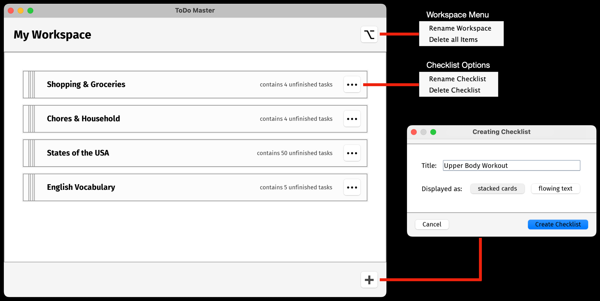
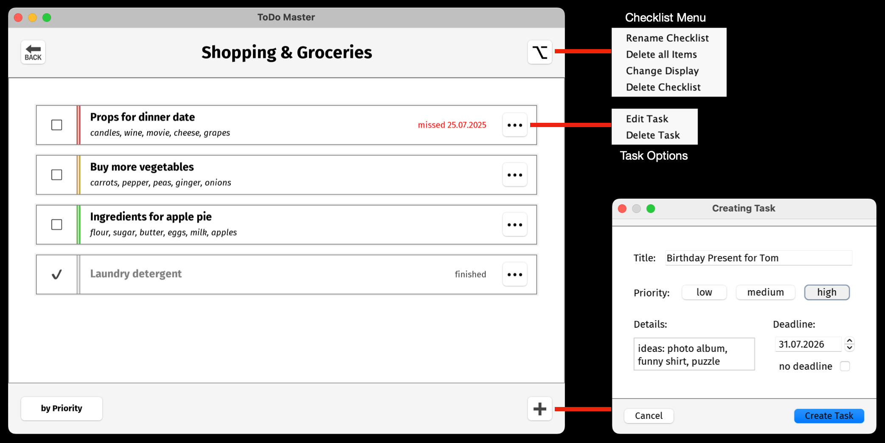
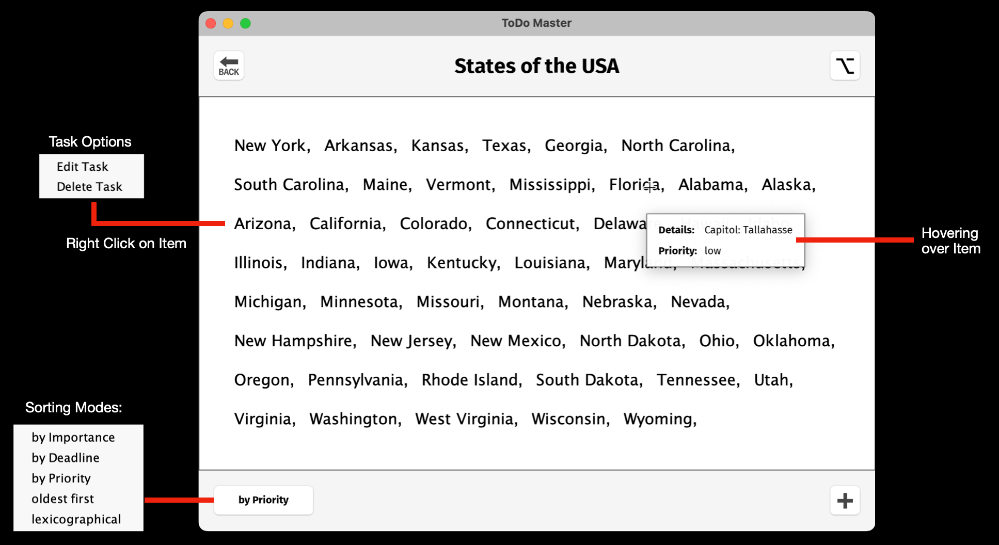
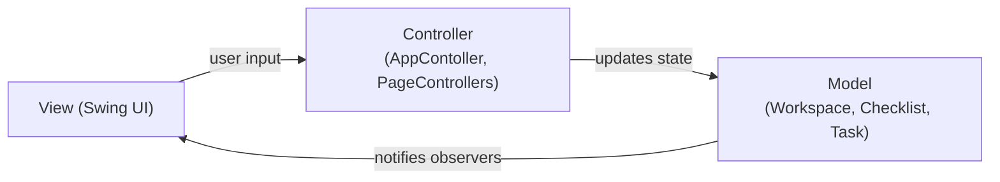

# 📋 ToDoMaster - Office Tool for Task Management

  

**TodoMaster** is a desktop **task management application** built with **Java Swing** using a clean **MVC architecture** and several classic design patterns. It allows users to organise tasks into checklists, manage priorities and deadlines, and persist data between sessions using JSON storage. The project demonstrates **object-oriented design**, **MVC architecture**, and reactive UI updates using the **Observer pattern**.

---
## ⭐ Key Features

- Workspace containing multiple checklists
- Task management with:
	- title and description
	- priority (`HIGH` / `MEDIUM` / `LOW`)
	- optional deadline
	- completion status
- Task sorting by:
	- importance
	- deadline
	- priority
	- creation date
	- lexicographic order
- Two UI display modes:
	- Card view
	- Flowing text view
- Automatic data persistence using JSON
- Auto-save on application exit

---
## 📸 Screenshots / Demonstration

### Workspace Page


### Checklist Page in Card View


### Checklist Page in Text View


---
## 🚀 Running the Application

**Requirements**:
- Java **17+**
- Maven

**Build from Repository Root:**
```shell
mvn clean package
```

**Run from Repository Root:**
```shell
mvn exec:java -Dexec.mainClass="Main"
```

---
## 🏗 Architecture

The application follows a **Model–View–Controller (MVC)** architecture.



### UML Diagram

A detailed UML diagram illustrating the architecture is available at [**`uml/class_diagram.png`**](uml/class_diagram.png).


### Key Design Patterns

- **MVC** – separation of UI, logic, and data
- **Observer Pattern** – model changes update the UI automatically
- **Singleton Pattern** – single global `App` instance
- **Factory-like UI composition** – dynamic panel generation
- **Strategy-like sorting** – different task sorting modes

---
## 🗃️ Project Structure

```text
src/main/java
│
├── App.java
├── Main.java
│
├── controller/            → Application and page controllers
│   ├── AppController
│   ├── WorkspacePageController
│   └── ChecklistPageController
│
├── model/                 → Core domain objects
│   ├── Workspace
│   ├── Checklist
│   ├── Task
│   ├── AbstractData
│   └── AbstractCollection
│
├── view/                  → UI components
│   ├── pages              → Workspace and checklist pages
│   ├── panels             → Task and checklist panels
│   ├── dialogs            → Dialogs for editing/creating data
│   └── controls           → Buttons and UI controls
│
├── auxiliaries/           → Utility classes
│   ├── JsonFileStorage
│   ├── TaskSorter
│   └── FontLoader
│
└── resources/
    ├── data/exemplary.json
    └── fonts/
```

Additional directories:

```text
doc/      → generated Javadoc documentation
uml/      → UML diagram for the project
target/   → Maven build output
```

---
## 💾 Data Persistence

Application data is automatically saved to `~/toDoMaster-data.json`. If no data file exists on startup, the application loads an example workspace from the bundled resource `src/main/resources/data/exemplary.json`.

---
## 📖 Documentation

Full API documentation is generated via Javadoc and available via the file `doc/index.html`

---
## 🎯 What This Project Demonstrates

This project showcases:

- Clean object-oriented design
- MVC architecture in desktop applications
- Observer pattern for reactive UI updates
- Swing UI component composition
- JSON-based persistence
- Separation of domain model, UI, and controllers
- Modular and maintainable project structure

It serves as a portfolio project demonstrating practical software engineering principles and architectural patterns in Java desktop application development.

---
## 🙌 Get Involved

Feel free to:

- Clone or fork the repository
- Explore the codebase and project architecture
- Study the implemented design patterns
- Extend the application with new features
- Use the project as inspiration for your own Java Swing or MVC-based applications

---
### Thanks for Visiting!

I hope this project serves both as a learning resource and a demonstration of practical software engineering concepts such as MVC architecture, design patterns, and clean application structure.

Happy coding! 🚀
